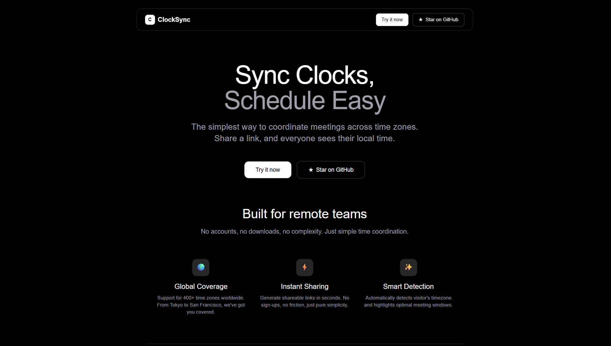

# ClockSync - Sync Clocks, Schedule Easy



**ClockSync** is the simplest way to coordinate meetings across time zones. Share a link, and everyone sees their local time. No accounts, no downloads, no complexity.

## 🌟 Features

- **🕐 Real-time Time Conversion**: Convert times between 400+ time zones instantly
- **🔗 Shareable Links**: Generate links that show the same meeting time in everyone's local timezone
- **🌍 Automatic Timezone Detection**: Automatically detects visitor's timezone for seamless experience
- **⏰ Working Hours Indicator**: Visual indicators showing if it's working hours in each timezone
- **🎨 Minimalist UI**: Clean, dark interface that focuses on what matters

## 🛠️ Tech Stack

- **Frontend**: Next.js 16.0.1, React, TypeScript
- **Timezone Data**: @vvo/tzdb (400+ timezones)

## 🚀 Quick Start

### Prerequisites
- Node.js 18+ and npm

### Installation

1. **Clone the repository**
   ```bash
   git clone https://github.com/vinodjangid07/ClockSync.git
   cd ClockSync
   ```

2. **Install dependencies**
   ```bash
   npm install
   ```

3. **Start development server**
   ```bash
   npm run dev
   ```

4. **Open your browser**
   Navigate to [http://localhost:3000](http://localhost:3000)

## 📖 Usage

### Basic Time Conversion
1. Visit ClockSync
2. Click "Try ClockSync" to access the tool
3. Select your source timezone and time
4. Choose destination timezone to see the converted time
5. Add multiple timezones to compare times across regions

### Share Meeting Times
1. Set up your meeting time and relevant timezones
2. Click "Generate Shareable Link" 
3. Share the link with participants
4. Everyone sees the meeting time in their local timezone


## 🤝 Contributing

Contributions are welcome! Here's how you can help:

1. **Fork the repository**
2. **Create your feature branch**
   ```bash
   git checkout -b feature/amazing-feature
   ```
3. **Commit your changes**
   ```bash
   git commit -m 'Add some amazing feature'
   ```
4. **Push to the branch**
   ```bash
   git push origin feature/amazing-feature
   ```
5. **Open a Pull Request**

### Development Guidelines
- Follow the existing code style and conventions
- Test your changes across different timezones
- Ensure responsive design on various screen sizes
- Update documentation for new features

## 📄 License

This project is licensed under the MIT License - see the [LICENSE](LICENSE) file for details.

## 🔗 Links

- **Developer**: [Vinod Jangid](https://github.com/vinodjangid07)

---

<p align="center">Built by <a href="https://github.com/vinodjangid07">Vinod Jangid</a></p>
